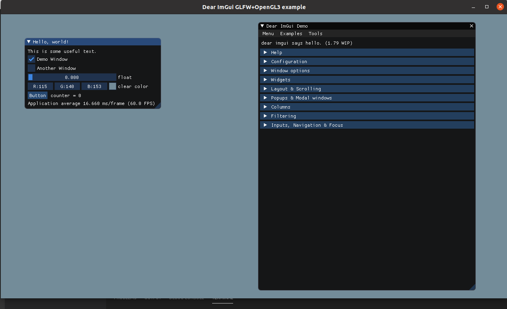

# realtime-graphic-demo-base
This is a lightweight realtime graphic demo base frame with opengl(glfw+glad) and [Dear ImGui](https://github.com/ocornut/imgui) on Linux--------Suit my personal little CG test and illustration. 

dependency needed : glfw3,opengl3+

